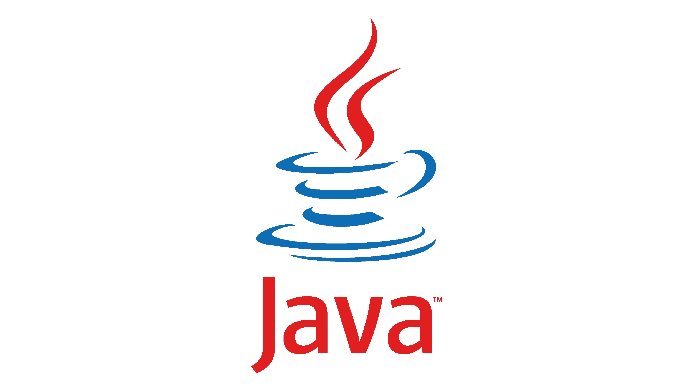

Welcome to the backend of our Banking Application – a powerful API that replicates essential online banking services for a seamless user experience. With this backend, users can perform various operations similar to those offered by traditional banking systems, including paying bills, buying airtime, paying fees, and checking their account balance.
🌟 Features

Our banking application backend offers the following features:

    Bill Payments: Easily manage and pay your utility bills.
    Airtime Purchases: Recharge your mobile network account directly from your bank balance.
    School Fees Payments: Make education payments with ease.
    Balance Check: View your current account balance and recent transactions.

🚀 Built With

This backend was created using the following technologies:

     

    Java – Backend logic and core application structure.
    Spring Boot – Framework for RESTful API development.
    PostgreSQL – Database management and storage.
    Maven – Dependency management and project building.

📖 Getting Started
Prerequisites

To run this project, you need:

    Java 11 or higher
    Maven
    PostgreSQL

Installation

    Clone the Repository

    bash

git clone -b feature https://github.com/yourusername/your-repo.git
cd your-repo

Configure Database
Update the application.properties file with your PostgreSQL database details.

Run the Application

bash

    mvn spring-boot:run

    The application will start on http://localhost:8082.

📂 Project Structure

    /src - Main application source files.
    /controller - REST API endpoint definitions.
    /service - Business logic for banking operations.
    /repository - Database interactions.

🤝 Contributing

We welcome contributions to improve functionality or resolve issues. Please create a new branch for your feature or bug fix and submit a pull request.
Let’s make digital banking efficient and secure!
